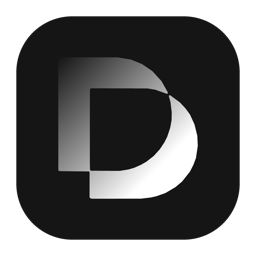

# DutyDeck

DutyDeck is a local-first AI desktop app that brings multi-model Chat, general-purpose Agent workflows, workspaces, Skills, MCP, remote bots, and memory into one open-source client.

It is not just another chat box. DutyDeck is meant to become a long-lived Agent workbench for your personal workflows: use Chat for simple answers, use Agent when the task needs to act on files, tools, projects, and longer context.



> **This repository is a modified edition of Proma.** DutyDeck evolves from the upstream open-source project [Proma](https://github.com/proma-ai/Proma) (AGPL-3.0-only) and is independently maintained by [kuangtao22](https://github.com/kuangtao22). It is not affiliated with, nor endorsed by, the official Proma project. See [Relationship To Upstream Proma](#relationship-to-upstream-proma) for the upstream baseline and differences.

[中文 README](./README.md) | [Beginner Tutorial](./tutorial/tutorial.md) | [Changelog](./release-notes/bone) | [Download DutyDeck](https://github.com/kuangtao22/Proma/releases/latest)

## What DutyDeck Can Do

- **Chat mode**: multi-model conversations, attachments, image input, Markdown / Mermaid / KaTeX / code highlighting, parallel conversations, system prompts, and context controls.
- **Agent mode**: the Agent core has fully migrated to DutyDeck's built-in Pi Agent Runtime with no third-party Agent runtime; workspace isolation, permission modes, file operations, streaming output, plan confirmation, and ask-user interactions are all supported.
- **In-app browser automation**: the Agent can directly operate the built-in managed browser—opening pages, inspecting page structure, clicking / filling controls, switching tabs, and opening `localhost` dev services; in-site search, post-login pages, dynamic content, and local HTML previews can all be handled by the Agent without manual copy-paste.
- **Collaboration and tasks**: complex work can be split into traceable collaboration sub-agents and tasks, with calls and results shown in the message stream.
- **Skills, MCP, and project instructions**: each DutyDeck project manages its own Skills and MCP servers. Projects can declare trusted project instructions via `AGENTS.md`, and legacy `CLAUDE.md` configurations are auto-migrated. Project files can use a user-selected local project root or a DutyDeck-managed blank-project directory.
- **Remote bots**: Lark / Feishu bot bridging is supported, with DingTalk and WeChat bridge entry points also present in the app.
- **Memory and tools**: Chat and Agent can share workspace memory, with memory changes tracked and refresh prompts shown in the UI; web search, built-in Chat tools, and Agent recommendation helpers are also available.
- **Local-first data**: conversations, workspaces, attachments, settings, and Skills are stored under `~/.proma/` as JSON / JSONL files, without a local database.
- **Desktop experience**: auto-update, proxy settings, file preview, global shortcuts, quick task window, Agent Island run states, voice input, and light / dark / system themes.

## Getting Started

### Download

Download DutyDeck from [GitHub Releases](https://github.com/kuangtao22/Proma/releases), with macOS Apple Silicon, macOS Intel, Windows, Ubuntu/Debian x86_64 `.deb` and Linux x86_64 AppImage builds. Artifacts are named like `DutyDeck-<version>-macos-arm64.dmg`, `DutyDeck-<version>-windows-x64.exe` and `dutydeck_<version>_amd64.deb`. Linux installation, security boundaries and support scope are documented in [Linux notes](./docs/linux.md).

All model channels are configured by you; DutyDeck ships no built-in subscription channel. The upstream commercial edition of Proma (proma.cool) is unrelated to this project.

### Relationship To Upstream Proma

DutyDeck is a modified edition of Proma, not an official release:

- **License**: AGPL-3.0-only, identical to upstream. Full terms in [LICENSE](./LICENSE).
- **Upstream baseline**: the fully merged upstream content baseline is `v0.19.31` (2026-09-05); later official versions are ported selectively, so features here are not equivalent to the latest official release.
- **Version numbering**: `0.19.53-bone.10` means "upstream version + this repository's build number"; `-bone.<n>` only marks this repository's own release order.
- **Added by this repository**: canvas, server operations workbench, API workbench, today activity, plus the permission confirmations, auditing and local encryption around them.
- **Attribution**: upstream copyright belongs to Proma's author and contributors; this repository's modifications are likewise licensed to everyone under AGPL-3.0.


### First Setup

1. Open DutyDeck and finish the environment check. Agent mode depends on local tooling, especially Git, Node.js / Bun, and a usable shell.
2. Go to **Settings > Channels**, add at least one AI provider channel, and fill in Base URL, API Key, and model list.
3. Chat mode can use OpenAI, Anthropic, Google, or OpenAI-compatible channels.
4. Agent uses the Pi Runtime and can use any enabled model channel.
5. Go to **Settings > Agent** and choose the default Agent channel, model, and workspace.
6. Configure memory, web search, or Feishu / DingTalk / WeChat bridges from their corresponding settings tabs if needed.

## Choosing A Mode

### Use Chat For

- Everyday Q&A, explanation, translation, rewriting, and lightweight code discussion.
- Reading attachments and summarizing or comparing their content.
- One-off conversations enhanced by web search or memory tools.
- Comparing outputs from multiple models or exploring different system prompts.

### Use Agent For

- Creating, editing, or organizing local files.
- Research, report writing, and multi-step tasks.
- Work that needs MCP, Skills, Shell, Git, project files, or external context.
- Tasks that benefit from permissions, plan mode, background execution, or remote bot follow-up.

In short: **use Chat when you need an answer; use Agent when you need work to be done.**

## Screenshots

### Chat Analysis

Use Chat for lightweight but practical analysis: compare audience needs, generate a table, and shape first-screen README copy quickly.


### Agent Workbench

Agent works across the project root and session workspace, reads project files, progresses through tasks, outputs structured findings, and keeps reusable files visible in the right-side file panel.


### Skills

Each workspace can keep its own reusable Skills. The `feedback-synthesis` Skill shown here turns scattered feedback, interviews, and issues into themes, evidence, and priority suggestions.


### Skills & MCP

The same workspace can manage stdio and HTTP MCP servers, enabling or disabling external context per project.


### Streaming Voice Input

DutyDeck supports Doubao-powered streaming voice input, both inside DutyDeck and across the desktop:

- Inside DutyDeck: press Ctrl + Backtick to start recognition, then press it again to finish and insert the transcript into the active DutyDeck input box.
- Outside DutyDeck: press Ctrl + Backtick to start recognition, then press it again to finish and insert the transcript at the current cursor position. If there is no active cursor, DutyDeck writes the transcript to the clipboard.


## Agent Runtime and Providers

DutyDeck's Agent mode is driven by a single **Pi Agent Runtime**, powered by `@earendil-works/pi-coding-agent`, `pi-agent-core`, and `pi-ai`, with no third-party Agent runtime. Enabled DutyDeck channels are dynamically registered as Pi providers, supporting OpenAI Chat Completions / Responses, Google Generative AI, Anthropic Messages, and compatible endpoints. Historical sessions from the early Claude runtime are retained as read-only records: they can be viewed, but not continued, forked, or rewound.

| Channel type | Chat | Pi Agent |
| --- | --- | --- |
| Anthropic / Anthropic-compatible | Supported | Supported |
| Anthropic-protocol channels such as DeepSeek, Kimi API / Coding Plan, Zhipu Coding Plan, MiniMax, and Xiaomi MiMo | Supported | Supported |
| OpenAI, OpenAI Responses, Google, Zhipu AI, Doubao, and Qwen | Supported | Supported |
| Custom OpenAI-compatible endpoints | Supported | Supported |
| ChatGPT subscription (Codex OAuth) | — | Supported |
| xAI subscription (Grok OAuth) | — | Supported |

## Tech Stack

| Layer | Technology |
| --- | --- |
| Runtime | Bun |
| Desktop | Electron 39 |
| Frontend | React 18 + TypeScript |
| State | Jotai |
| Styling | Tailwind CSS + Radix UI |
| Rich text input | TipTap |
| Markdown / diagrams / math | React Markdown + Beautiful Mermaid + KaTeX |
| Code highlighting | Shiki |
| Build | Vite + esbuild |
| Distribution | electron-builder |
| Agent runtime | Pi: `@earendil-works/pi-* @0.82.1` |

## Architecture

DutyDeck's core communication path is:

```text
shared types and IPC constants
  -> main/ipc.ts handlers
  -> preload/index.ts window.electronAPI bridge
  -> renderer Jotai atoms and React components
```

Main-process services live in `apps/electron/src/main/lib/`:

- `agent-orchestrator.ts`: Pi Agent orchestration, environment variables, event streams, and error handling.
- `adapters/pi-agent-adapter.ts`: Pi runtime adapter and session management.
- `agent-session-manager.ts`: Agent session index and JSONL message persistence.
- `agent-workspace-manager.ts`: DutyDeck workspaces, project roots, MCP, and Skills.
- `chat-service.ts`: Chat streaming, Provider Adapters, tool activity.
- `conversation-manager.ts`: Chat session index and message storage.
- `channel-manager.ts`: channel CRUD, API key encryption, connection tests, model fetching.
- `feishu-bridge.ts` / `dingtalk-bridge.ts` / `wechat-bridge.ts`: remote bot bridges.
- `chat-tool-*`, `document-parser.ts`, `workspace-watcher.ts`: tools, document parsing, and file watching.

Renderer state is managed with Jotai. Key atoms live in `apps/electron/src/renderer/atoms/`. Agent IPC listeners are mounted globally at the app root so streaming events, permission requests, and background tasks survive view changes.

## Packaging Notes

The Pi Agent runtime runs as an esbuild external dependency in the main process. Before invoking `electron-builder`, the Electron packaging scripts run `bun run sync:runtime-deps` to copy these runtime dependency closures into the app directory:

- `@earendil-works/pi-coding-agent`, `pi-agent-core`, and `pi-ai`
- Pi runtime native modules and `pdfjs-dist`

When changing packaging, verify that:

- `build:main` / `watch:main` keep Pi runtime dependencies external.
- `scripts/sync-runtime-deps.ts` stays aligned with the external runtime dependency list.
- `electron-builder.yml` retains the `asarUnpack` rules required by Pi native add-ons.
- After `bun run dist:fast` on a target platform, verify that Pi Agent can start, call tools, and resume sessions.

See [AGENTS.md](./AGENTS.md) for the full engineering conventions.

## Contributing

Bug fixes, documentation improvements, tests, UX polish, Skills, MCP configs, and real-world Agent workflows are all welcome.

Before opening a PR, please check:

- Use Bun scripts and do not mix npm / pnpm lockfiles.
- Use Jotai for state management.
- Keep the app local-first and prefer config files plus JSON / JSONL storage.
- Do not use TypeScript `any`; prefer `interface` for object shapes.
- When adding IPC, update shared types, main handler, preload bridge, and renderer calls together.
- Bump the patch version of affected packages when behavior changes.
- Add focused tests where possible, especially for shared logic, IPC contracts, and persistence formats.

## Credits

- [Shiki](https://shiki.style/): code highlighting.
- [Beautiful Mermaid](https://github.com/lukilabs/beautiful-mermaid) and [Mermaid](https://mermaid.js.org/): Mermaid diagram rendering with the official fallback renderer.

## Authors and Maintainers

- Upstream Proma author: [erlich.fun](https://erlich.fun)
- DutyDeck maintainer: [kuangtao22](https://github.com/kuangtao22)

## License

DutyDeck is licensed under the [GNU Affero General Public License v3.0 (AGPL-3.0-only)](./LICENSE). This repository's `LICENSE` is byte-identical to upstream Proma and adds no extra restrictions.

**You may**: use, modify, distribute and commercially use DutyDeck and its derivatives, provided you comply with AGPL-3.0 — distributing source or modified forms, and offering the software over a network, both require publishing the complete corresponding source, and derivative works must stay under AGPL-3.0.

**Permanent open-source commitment**: every DutyDeck release is published under AGPL-3.0 in a public repository, and the corresponding source of any historical version remains obtainable. This repository neither collects nor accepts the right to relicense contributions under proprietary terms — nobody, maintainers included, can close this code.

**No commercial license exemption**: this project does not offer, and is not entitled to offer, an AGPL commercial exemption. For closed-source integration, comply with AGPL-3.0 yourself, or request a commercial license from the upstream Proma project that owns the copyright.

By submitting a Pull Request to DutyDeck you agree to license your contribution under AGPL-3.0-only to everyone; this project does not require you to transfer copyright.
