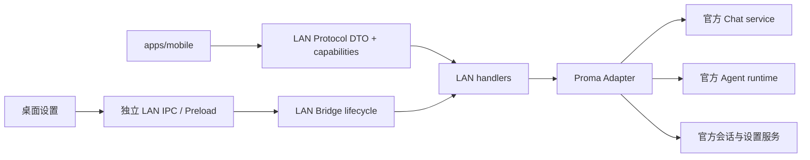

# LAN 与移动端上游兼容优化设计

## 结论

本轮先建设上游隔离层，再修复连接可靠性并加入安全扫码配对。LAN Bridge、移动端和后续公网能力继续作为 Proma fork 的独立扩展，不采用完整网页反向代理，也不把实现继续散落到上游高频核心文件。

目标不是承诺上游永不变化，而是把变化收敛到单一适配层，并在升级发布前用自动化检查发现不兼容。

## 目标

1. 合并官方 Proma 新版本后，桌面端继续获得上游新功能和 Bug 修复。
2. 上游 Agent、Chat、会话或设置接口变化时，移动端协议和 UI 不被迫同步大改。
3. 修复空闲连接约 30 秒被错误断开的心跳缺陷。
4. 断线时立即结束挂起请求，重连后重新认证并恢复页面数据和订阅。
5. 手机通过短时、一次性二维码完成配对，不再手工输入 IP、端口和 PIN。
6. 已配对设备可在桌面端查看和撤销，刷新 PIN 与撤销设备具有明确、不同的语义。
7. 新旧客户端通过协议版本和能力协商实现加法式演进。

## 非目标

- 本轮不实现公网隧道、Cloudflare Quick Tunnel、自建中继或公网 TLS 终止。
- 本轮不实现工具审批、文件与图片附件、流式事件重放或推送通知。
- 本轮不把桌面 Renderer 完整代理给手机，不依赖上游 DOM、CSS 或 URL 参数。
- 本轮不修改 README、教程或发布日志。
- 本轮不保证每个新增桌面 UI 功能自动出现在移动端；新增能力必须经过适配器和协议显式暴露。

## 设计原则

### 上游代码与 fork 扩展分离

fork 自有实现集中在以下边界：

- `apps/electron/src/main/lib/lan-bridge/`：服务、认证、协议路由和 Proma 适配器。
- `apps/mobile/`：独立移动端界面。
- `packages/shared/src/types/lan-bridge.ts`：LAN 协议、IPC 与稳定 DTO。

上游高频文件只保留稳定接缝：

- `apps/electron/src/main/index.ts`：一个 Bridge 注册调用。
- `apps/electron/src/main/ipc.ts`：一个 LAN IPC 注册调用。
- `apps/electron/src/preload/index.ts`：一个 LAN Preload API 组合点。
- 构建和打包配置：一个移动端构建步骤和一个资源目录声明。

### 不直接暴露上游内部类型

当前 LAN 协议直接引用 `ConversationMeta`、`AgentSessionMeta` 等上游类型，这会把上游字段变化传递到移动端。新设计定义 LAN Bridge 自有 DTO，只包含手机真正需要的稳定字段。

Proma Adapter 负责把当前上游对象映射为 LAN DTO。上游接口变化时只调整 Adapter 和对应契约测试，不修改协议 handler 与移动 UI。

### 协议只做加法演进

服务端连接确认中返回：

- `protocolVersion`：当前协议主版本。
- `serverVersion`：Proma 桌面版本。
- `capabilities`：服务端实际支持的能力集合。

客户端只展示双方共同支持的能力。已有路由不改名、不改变成功响应语义；新增字段保持可选。未来确需破坏性变化时新增协议主版本并保留上一主版本兼容窗口。

## 架构

## 模块设计

### Proma Adapter

新增 LAN 专用适配器接口，负责以下能力：

- 列出 Chat 与 Agent 会话。
- 读取会话消息。
- 新建、发送和停止 Agent 会话。
- 发送和停止 Chat 对话。
- 列出工作区、模型和渠道。
- 订阅并归一化 Agent 与 Chat 事件。

handlers 不再直接导入多个官方 manager/service。Adapter 输出 LAN 自有 DTO 和统一事件，避免上游实现细节穿透协议层。

### IPC 与 Preload 接缝

LAN IPC handler 移入独立模块，由主 IPC 注册函数调用一次。LAN Preload API 的类型与实现移入独立模块，根 `ElectronAPI` 通过组合获得接口。

这不会改变四层 IPC 契约，只是把 LAN 自有代码从高频大文件中移出。共享通道与类型、主进程 handler、Preload bridge、Renderer 调用仍必须同时检查。

### 心跳与连接状态

服务端每 15 秒发送一次应用层心跳，记录最后一次 `pong` 时间。连接只有在连续 45 秒未收到 `pong` 后才终止，首次检查不得在发送首个心跳前误杀空闲客户端。

移动端收到心跳立即回复。WebSocket 关闭时：

- 清除每个请求的超时计时器。
- 以统一的 `CONNECTION_LOST` 错误拒绝所有挂起请求。
- 使用带上限的指数退避重新连接。
- 重连成功后验证现有 Token，重新加载当前页面数据并恢复订阅。

本轮不缓存断线期间的流式增量；重连后以持久化消息记录为准重新加载。

### 一次性二维码配对

桌面端按需生成内存态配对票据：

- 使用密码学安全随机数。
- 有效期 120 秒。
- 只能成功消费一次。
- 与当前 Bridge 实例绑定，服务重启后失效。
- 失败尝试沿用按客户端 IP 限速。

二维码内容为手机页面地址，票据放在 URL fragment 中，避免出现在 HTTP 请求日志和静态资源请求中。移动页面读取 fragment 后立即从地址栏清除，并通过 WebSocket `auth.pairTicket` 交换设备 Token。

原有六位 PIN 配对继续保留，供手工连接和第三方客户端使用。

### 设备认证与撤销

Token 增加 `deviceId` 和 `tokenVersion`。设备元数据使用原子 JSON 文件持久化到 `~/.proma`，只保存设备标识、显示名、创建时间、最后访问时间、版本和撤销状态，不保存 PIN、Token 或签名密钥。

每次 Token 验证同时检查：

- HMAC 签名与有效期。
- LAN 模式下的客户端 IP 绑定。
- 设备存在且未撤销。
- Token 版本与设备当前版本一致。

撤销设备时递增 Token 版本并断开该设备现有连接。刷新 PIN 只阻止继续使用旧 PIN 配对，不撤销已配对设备；桌面设置提供明确的“撤销设备”命令。

### Bridge 自愈

LAN Bridge 接入现有 `BridgeRegistration.needsRecovery` 与 `recover`。系统恢复、解锁或健康检查发现 Bridge 为 error 状态时，使用注册表统一恢复，不另建后台守护机制。

## 上游升级策略

### Git 历史

- `upstream` 只跟踪官方仓库，不承载 fork 提交。
- 已发布的 fork `main` 通过明确的官方标签 merge 获取更新，不重写历史。
- fork 提交按协议、核心服务、Adapter、IPC/Preload、移动端、打包、测试拆分，不 squash 成单个巨型提交。
- 合并冲突优先解决少数共享接缝，再通过 Adapter 契约测试处理官方 API 语义变化。

### 自动化兼容门槛

增加可在本地和 CI 重复执行的 fork 兼容检查，至少覆盖：

1. LAN 协议版本、路由集合和能力声明一致。
2. Proma Adapter 能从当前官方服务映射出稳定 DTO。
3. PIN、一次性票据、设备撤销、Token 版本和按 IP 限速。
4. 心跳不会误杀正常空闲连接，超时连接会被清理。
5. 断线会拒绝挂起请求，重连会重新认证和订阅。
6. 移动端 typecheck 与 production build。
7. 根 typecheck、LAN 定向测试和 Electron build。
8. 打包资源中存在可用的 `mobile-dist`。

上游更新分支只有在这些检查全部通过后才能合并到 fork `main`。

## 错误处理

- 过期或已消费票据返回稳定错误码，不回显票据。
- 已撤销设备返回 `DEVICE_REVOKED`，客户端删除本地 Token 并回到配对页。
- 协议主版本不兼容时返回 `PROTOCOL_UNSUPPORTED`，客户端显示升级提示，不尝试未知操作。
- Adapter 捕获上游异常并映射为 LAN 稳定错误，不把内部堆栈或路径暴露给手机。
- 设备文件损坏时使用安全读取降级为空设备列表，不影响 Proma 主应用启动。

## 性能与资源影响

- Adapter 只做字段映射，不复制完整会话或附件，额外 CPU 与内存开销可忽略。
- 设备文件只在配对、撤销和受节流的最后访问时间更新时原子写入，避免每条 WebSocket 消息写磁盘。
- 二维码仅在设置页请求时生成，并缓存到票据过期，不进入常驻轮询。
- 心跳频率从当前逻辑调整为 15 秒，每个客户端每分钟增加约 8 条小消息；默认 20 个连接时资源开销很小。

## 兼容与迁移

- 现有 PIN 配对流程继续可用。
- Bridge 服务重启本来就会轮换内存 HMAC 密钥，因此升级后的首次重新配对不增加额外兼容损失。
- 现有 `lan-bridge.json` 保持兼容，只新增独立设备元数据文件。
- 新客户端遇到旧服务时按协议版本缺失处理，只使用现有能力。
- 旧客户端遇到新服务时忽略新增连接字段并继续使用原有路由。

## 验收标准

1. 空闲 60 秒的正常客户端保持连接；停止回复心跳的客户端在预期超时后断开。
2. WebSocket 断开后所有挂起请求立即失败，不等待原 15 秒超时，也不残留计时器。
3. 手机扫描二维码后无需手输字段即可完成配对；票据过期、重复使用和错误 IP 尝试均被拒绝。
4. 桌面端可查看并撤销设备；撤销后旧 Token 和现有连接立即失效。
5. PIN 配对和现有第三方客户端仍可工作。
6. handlers 仅依赖 Proma Adapter，不再直接依赖多个官方 service/manager。
7. LAN IPC 与 Preload 代码从高频大文件移出，根文件仅保留稳定组合点。
8. 定向测试、移动端构建、根 typecheck、Electron build 和打包资源检查全部通过。
9. 在模拟官方类型字段或调用签名变化的契约测试中，只需修改 Adapter 即可恢复通过。

## 后续阶段

完成本设计后，工具审批、附件、流式事件序号与重放作为协议能力分别增加；公网访问必须复用设备认证与撤销机制，并单独设计 TLS、隧道供应链、可信代理头和后台保活，不直接放宽 RFC 1918 访问限制。
