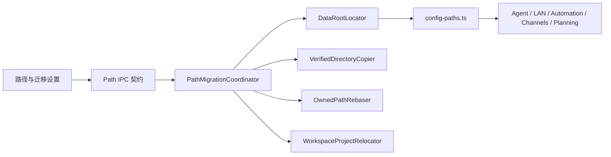
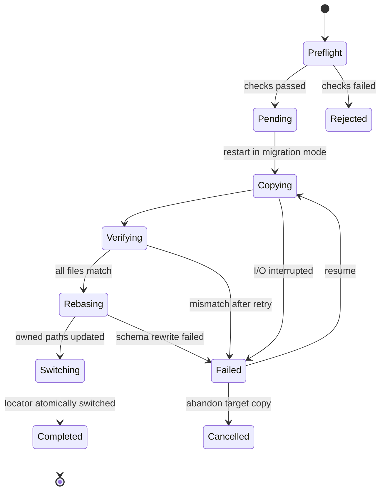

# Proma 文件路径管理与迁移设计

## 1. 目标

为 Proma 增加两项边界独立、入口统一的能力：

1. 管理并迁移 Proma 业务数据根目录。当前默认目录为 `~/.proma`，包含会话、附件、Skills、配置、工作区元数据、Automation、渠道数据和任务/日程数据库。
2. 管理并迁移单个 Agent 项目的实际文件目录，包括外部本地项目和 Proma 托管项目。

迁移必须保证数据不丢失、不产生新旧目录并行写入，并尽量把自有改动限制在稳定适配层内，降低后续合并官方 Proma 更新时的冲突和回归风险。

## 2. 已确认的产品约束

- 数据根迁移与项目文件迁移是两个独立操作，但在同一个“路径与迁移”设置页展示。
- 迁移采用“复制、完整校验、切换、保留旧目录”的策略，不自动删除源目录。
- 支持本机磁盘和移动磁盘。NAS/网络共享允许选择，但需要风险提示和更严格的可用性检查。
- 自定义数据根离线时禁止自动回退旧目录，避免形成两套分叉数据。
- 项目仍有 Agent 任务或 Automation 运行时禁止迁移。
- linked worktree 或活动 worktree 尚未解除时禁止迁移项目。
- UI 必须复用 Proma 现有设置组件、主题变量、按钮和 Lucide 图标，不建立独立视觉体系。
- 开发版与正式版继续共享同一个业务数据根。

## 3. 方案选择

采用“固定定位文件 + 受控迁移 + 重启切换”。

未采用的方案：

- 符号链接：Windows 权限、移动盘掉线、NAS 语义和故障诊断不稳定。
- 运行中热切换：需要同时正确停启 Agent、LAN、Automation、渠道、watcher 和 SQLite，遗漏任一文件句柄都会产生新旧目录并行写入。

推荐方案保留现有 `getConfigDir()` 调用契约。上层模块无须知道数据根是否位于默认位置，自有功能集中在路径解析器、迁移协调器和设置 UI，能显著减少上游合并冲突。

## 4. 总体架构



### 4.1 `DataRootLocator`

固定定位文件为 `~/.proma-location.json`。它位于可迁移数据根之外，开发版与正式版共同读取，只保存启动所需的最小状态。

```ts
interface DataRootLocatorFile {
  version: 1
  activeRoot: string
  previousRoot?: string
  migration?: DataRootMigrationRecord
}

interface DataRootMigrationRecord {
  id: string
  sourceRoot: string
  targetRoot: string
  state: 'pending' | 'copying' | 'verifying' | 'rebasing' | 'failed'
  completedBytes: number
  totalBytes: number
  startedAt: number
  updatedAt: number
  error?: string
}
```

规则：

- 定位文件不存在时，唯一默认值是 `~/.proma`。
- 定位文件存在但损坏时，优先读取原子写备份；仍无法恢复则进入恢复页面，禁止静默创建空数据根。
- 默认数据根可以按现有行为首次自动创建；定位文件指定的自定义根不存在时不得自动创建，必须进入离线恢复。
- 定位结果在进程启动后缓存，正常运行期间不热切换。
- 定位文件与迁移状态使用 `safe-file.ts` 的原子写能力。

### 4.2 `config-paths.ts` 兼容层

`getConfigDir()` 改为调用 `DataRootLocator`，其余路径函数继续从 `getConfigDir()` 派生。上层函数名和调用方式保持不变。

当前 `agent-prompt-builder.ts` 直接使用 `homedir()` 和 `.proma` 拼接工作区路径，必须改为调用统一路径 API。新增兼容检查，禁止主进程业务代码再次直接拼接 `~/.proma`。

路径解析必须是无副作用的；目录创建仍由明确的目录 getter 或服务初始化完成。任何在模块导入阶段快照数据路径的服务需要改为在数据根确认可用后初始化，确保迁移模式和离线恢复模式不会提前访问业务文件。

### 4.3 `PathMigrationCoordinator`

协调器负责预检、迁移计划、迁移锁、进度事件、恢复和最终切换，不承载具体 UI。

职责：

- 校验源目录、目标目录、嵌套关系、权限、空间和设备类型。
- 确认不存在其他活跃 Proma 实例、Agent、Automation 或仍占用数据根的服务。
- 写入可恢复迁移记录并请求应用重启到迁移模式。
- 在迁移模式中调用复制、校验和路径重写组件。
- 只有全部步骤成功后才原子更新 `activeRoot`。
- 失败时保持旧目录为唯一活动数据根。

开发版与正式版使用固定侧车锁和实例登记信息。每个新版本实例在启动时登记实例身份和 PID；迁移预检只允许发起迁移的当前实例存活。迁移状态存在时，新启动实例进入迁移/等待界面而不是启动正常服务。

## 5. 数据根迁移流程

### 5.1 目标目录规则

- 用户通过原生目录选择器选择“数据根本身”，不是父目录。
- 首次迁移仅接受空目录；恢复中仅接受带有匹配迁移 ID 的未完成目标目录。
- 目标不能等于源目录、位于源目录内部或包含源目录。
- 目标不能是文件、不可写目录或无法获得剩余空间的未知位置。
- NAS/网络共享允许继续，但确认界面明确提示断连和性能风险。

### 5.2 状态机



具体流程：

1. 正常模式执行快速预检并计算源目录大小。
2. 写入 `pending` 迁移计划，阻止新任务和后台操作。
3. 重启并携带迁移 ID。迁移模式只注册迁移 IPC 和进度窗口，不启动 Agent、LAN Bridge、Automation、渠道、watcher 或 Planning SQLite。
4. 再次检查源、目标和空间，防止重启前后环境变化。
5. 流式复制目录树，并持续写入断点状态。
6. 逐文件校验大小和 SHA-256；不一致文件自动重拷一次，第二次失败则终止。
7. 在目标副本中执行应用拥有的绝对路径重写。
8. 原子写定位文件：`activeRoot = targetRoot`，`previousRoot = sourceRoot`，清除迁移状态。
9. 重启进入正常模式。源目录继续保留，只在设置页显示“打开备份”和“验证后切回”。

### 5.3 文件复制语义

- 普通文件使用流式复制，避免大文件占满内存。
- 并发数保持较低并可配置，优先减少主机和网络盘压力。
- 目录保留权限和时间戳；平台不支持的元数据只记录警告，不影响内容校验。
- 符号链接按链接本身复制，不跟随到根目录外部。
- socket、设备文件等不支持的特殊文件使预检失败，不进行不完整迁移。
- 断点恢复按相对路径、大小和哈希识别已完成文件，不信任仅有同名文件。

### 5.4 数据根内绝对路径重写

复制完成后，由 `OwnedPathRebaser` 只修改 Proma 明确定义并拥有 schema 的字段。首版至少覆盖：

- `agent-sessions.json` 中位于旧数据根内的 `piSessionFile`、`forkSourceDir`、`attachedDirectories` 和 `attachedFiles`。
- 工作区配置、Automation 和其他索引中已定义为绝对路径且实际位于旧数据根内的字段。

重写规则：

- 只替换经过 `relative(oldRoot, value)` 验证确实位于旧根内部的绝对路径。
- 外部项目路径、用户附加的外部目录、系统路径和 URL 不修改。
- JSON 与元数据更新必须走 `safe-file.ts` 原子写。
- 任一 schema 重写失败时不切换定位文件。

## 6. 项目文件路径迁移

### 6.1 支持范围

- 外部本地项目：复制整个项目根到用户选择的新空目录，成功后更新 `projectRootPath`。
- Proma 托管项目：复制 `workspace-files/` 到新的外部目录，成功后写入 `projectRootPath`，完成“迁出”。
- Proma 的 Skills、MCP、记忆、会话工作台和项目元数据继续留在业务数据根，不随单个项目迁移。

### 6.2 工作区锁

迁移开始前为工作区建立短期独占锁。以下情况拒绝迁移：

- 工作区任一会话或其委派子会话正在运行。
- 绑定该工作区的 Automation 正在执行或即将进入执行阶段。
- 任一会话存在活动 worktree。
- Git 仓库存在 linked worktree，或当前目录本身是 linked worktree。
- 目标路径冲突、不可写、空间不足或与源路径嵌套。

锁存在期间，新 Agent 运行、Automation 和工作区文件写 IPC 必须返回明确的“项目正在迁移”错误。

### 6.3 提交顺序

1. 获取工作区锁并重新确认无活跃写入。
2. 使用与数据根迁移相同的复制和校验组件复制项目内容。
3. 原子更新 `agent-workspaces.json` 中的 `projectRootPath`。
4. 对该工作区会话中位于旧项目根内的 `forkSourceDir`、`attachedDirectories` 和 `attachedFiles` 做 schema-aware 重写。
5. 保留 `sdkSessionId`、`piSessionFile` 和 `piEntryBindings`，Pi `SessionManager.open` 继续显式接收新的 cwd，避免用户丢失会话上下文。
6. 释放旧目录 watcher，启动新目录 watcher，刷新 renderer 工作区状态。
7. 保留旧项目目录，提示用户验证后自行处理。

项目迁移失败时不更新工作区索引，旧项目路径继续生效。若索引更新后 watcher 切换失败，路径仍以已提交的新索引为准，界面显示 watcher 重试状态，不能反向改写索引造成双重事实源。

## 7. 离线与恢复

### 7.1 自定义数据根离线

启动时若 `activeRoot` 不存在或不可访问：

- 不启动正常业务服务。
- 显示恢复窗口和当前不可用路径。
- 提供“重新检测磁盘”“重新选择数据目录”“验证后切回旧备份”和“退出 Proma”。
- 切回旧备份前验证目录结构和定位文件版本，由用户显式确认。
- 禁止自动回退或自动新建空目录。

### 7.2 项目根离线

沿用现有 `projectRootStatus` 机制，在路径管理列表显示“离线”，提供重新定位。重新定位只更新引用，不复制文件；真正迁移使用独立“迁移”操作。

## 8. IPC 与事件契约

IPC 继续遵守四层契约：`packages/shared` 类型与通道、主进程 handler、preload bridge、renderer 调用。

首版固定的最小接口集合：

- `GET_PATH_MANAGEMENT_STATE`
- `PICK_DATA_ROOT_TARGET`
- `START_DATA_ROOT_MIGRATION`
- `GET_DATA_ROOT_MIGRATION_STATUS`
- `RESUME_DATA_ROOT_MIGRATION`
- `CANCEL_DATA_ROOT_MIGRATION`
- `RECOVER_DATA_ROOT`
- `START_WORKSPACE_RELOCATION`
- `GET_WORKSPACE_RELOCATION_STATUS`
- `CANCEL_WORKSPACE_RELOCATION`

主进程通过单一进度事件发送阶段、已处理字节、总字节、当前相对路径和可恢复错误。renderer 不自行推断迁移状态。

## 9. 设置页设计

现有“数据迁移”标签调整为“路径与迁移”，保留原有跨设备 ZIP 迁移说明，并新增两个区块。

### 9.1 Proma 数据位置

- 展示当前完整路径、可用状态、设备类型和占用空间。
- 提供“打开文件夹”和主要操作“迁移位置”。
- 存在旧位置时展示“上一次位置”和“打开备份”。
- 明确提示迁移后需要重启且源目录不会自动删除。

### 9.2 项目文件路径

- 每行展示项目名、实际路径、类型/状态和操作。
- 外部项目操作为“迁移”；托管项目操作为“迁出”；离线项目操作为“重定位”。
- 列表过长时沿用设置页滚动区域，不为列表增加嵌套卡片。

### 9.3 视觉约束

- 复用 `SettingsPanel` 的 277px 侧栏和内容宽度。
- 复用 `SettingsSection`、`SettingsCard`、`SettingsRow`、现有 `Button` 与 Radix 对话框。
- 使用主题变量，不写独立色板；自动适配全部明暗主题。
- 状态使用文本、圆点和现有语义色，不依赖单一颜色表达。
- 迁移进度使用稳定尺寸，动态文件名截断，避免布局跳动。

## 10. 错误处理

- 空间不足、不可写、路径嵌套、其他实例、活跃任务和 worktree 冲突属于预检错误，不创建目标副本。
- 复制或校验错误保留旧活动根和断点记录。
- 用户取消未开始的迁移可直接清除计划；已经复制的数据只在明确确认后清理，否则保留供恢复。
- 定位文件切换必须是整个数据迁移最后一个持久化步骤。
- 切换成功但应用重启失败时，下次手动启动仍读取新根；不得回写旧根。
- 所有错误消息面向用户说明“当前仍在使用哪个路径”和“是否产生目标副本”。

## 11. 性能与资源开销

正常运行：

- 启动时读取一次小型定位文件，结果进程内缓存。
- 路径 getter 只做缓存读取和 `join`，相对当前实现无可感知差异。
- 实例登记使用低频心跳，数据量固定。

迁移期间：

- 流式复制与哈希，内存占用与单个缓冲区大小相关，不随目录总大小增长。
- 限制复制并发，避免机械盘、移动盘和 NAS 被随机 I/O 打满。
- 目录扫描和 SHA-256 仅在迁移期间执行。

## 12. 测试策略

所有功能使用 BDD 风格可执行测试。

### 12.1 路径定位

- Given 定位文件不存在，When 解析业务根，Then 使用 `~/.proma`。
- Given 合法自定义根，When 开发版与正式版解析，Then 返回同一路径。
- Given 定位文件损坏或自定义根离线，When 启动，Then 进入恢复状态且不创建空目录。
- Given 主进程源码，When 执行兼容检查，Then 不存在绕过统一 API 的 `.proma` 硬编码拼接。

### 12.2 数据根迁移

- 正常迁移、同盘和跨盘迁移。
- 目标空间不足、权限不足、非空目标和路径嵌套。
- 文件校验失败、单文件重试、进程中断和断点恢复。
- 迁移时磁盘断开、启动时目标根离线、显式切回旧备份。
- 符号链接保留且不跟随外部目标。
- Planning SQLite/WAL、JSONL、附件和默认 Skills 完整复制。
- 目标副本中的 Proma-owned 绝对路径正确重写，外部路径保持不变。
- 定位文件只在全部校验和重写成功后切换。

### 12.3 项目迁移

- 外部项目迁移和托管项目迁出。
- 运行会话、Automation、活动 worktree 和 linked worktree 阻断。
- watcher 从旧根释放并监听新根。
- `projectRootPath` 与会话附加路径原子更新。
- Pi 会话在新 cwd 下继续使用原 artifact 和 entry bindings。
- 失败时工作区索引仍指向旧路径。

### 12.4 UI 与工程验证

- 设置页加载、空状态、可用、离线、迁移中、失败和完成状态。
- 键盘操作、对话框焦点、取消和重试。
- 默认浅色、默认深色及至少一个自定义主题的视觉检查。
- 运行相关 Bun 测试、`bun run typecheck` 和 `bun run electron:build`。

## 13. 上游兼容策略

- 保留 `config-paths.ts` 的公开函数，不要求上游业务模块理解自定义数据根。
- 新增路径解析、复制、重写和迁移服务文件，避免把大量 fork 逻辑堆入上游高冲突模块。
- `config-paths.ts` 只保留最小接入改动；`agent-prompt-builder.ts` 移除已发现的硬编码。
- 对 IPC、Preload 和 UI 使用独立通道与组件，不侵入 LAN Bridge 或 Pi runtime 协议。
- 每周上游兼容检查增加路径契约测试，确保官方新增功能继续通过统一路径 API 获得当前数据根。

## 14. 非目标

- 不自动删除旧数据目录或旧项目目录。
- 不提供运行中数据根热切换。
- 不同步两套数据根，也不把 NAS 当作多设备实时同步方案。
- 不自动修复 Git linked worktree 的内部绝对路径。
- 不迁移系统钥匙串、OAuth 登录态或 Electron `userData`。
- 不改变开发版与正式版现有业务数据共享规则。

## 15. 完成标准

- 用户能在设置页查看并迁移 Proma 数据根，迁移成功后重启并从新位置读取全部业务数据。
- 任一失败路径都不会让定位文件指向未完整校验的目标副本。
- 自定义根离线时不会创建或写入第二套业务数据。
- 用户能迁移外部项目或将托管项目迁出，并保留会话可读性与后续 Pi 上下文。
- 所有路径变更经过共享类型、主进程、Preload 和 renderer 的完整 IPC 契约。
- 自动化测试覆盖主要正常路径、边界、恢复和上游兼容合同。
