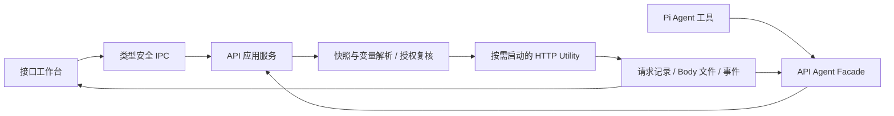

# Proma 接口工作台产品与技术方案

- 日期：2026-09-24
- 状态：用户已批准实施；阶段 A 已实现，实际验收与剩余边界见同日实施计划。
- 用户目标：在 Proma 中管理、保存和调试接口，让 Agent 能实际测试接口，并查看详细请求头、响应头及完整调试证据。
- 总体路线覆盖普通 HTTP/JSON 与 SSE；当前阶段 A 仅交付 HTTP/1.1 直连，SSE 等阶段 B 能力仍在规划中。

## 1. 建议与取舍

建议建立独立的「接口工作台」：接口集合负责可复用配置，一次请求记录负责真实执行证据，手动界面和 Agent 共用同一执行服务。

用户可以从一句「帮我检查这个接口为什么返回 401」进入：Agent 找到请求、选择环境、发送、查看详细记录、提出修正并复测，最后把可复用请求和测试规则保存到集合。每个结论都能打开对应的真实记录核对。

| 方案 | 收益 | 局限与成本 | 判断 |
| --- | --- | --- | --- |
| 独立工作台 + 共享执行器 | 手动与 Agent 请求一致；完整记录、管理与调试可持续扩展 | 要新增运行记录、执行器及 UI，但可复用既有桌面基础设施 | 推荐 |
| 在已有聊天 HTTP 工具上增加字段 | 最快补充状态码和部分头信息 | 原合同只有 GET/POST 和结果正文，缺集合、环境、历史、流式与详细传输信息 | 适合小工具，不足以承载本目标 |
| 嵌入其他 API 客户端 | 可以较快获得成熟编辑界面 | Agent 集成、凭据、存储、主题和运行记录容易形成两套体系；还需单独评估许可证与维护成本 | 暂不采用 |

产品成败取决于三个闭环：可重复发送、可解释失败、可保存复用。首版应同时交付这三个闭环和 Agent 接入。

## 2. 用户流程与界面

### 导航和资源归属

- 在 Proma 右侧工作区增加「接口」标签，与运维等模块同级，可展开为宽工作区。
- 接口资产归当前 Proma workspace；内部按「集合 → 文件夹 → 请求」组织。请求不随聊天会话删除，历史保留发起会话的可失效引用。
- 测试环境属于同一 workspace，可供多个集合显式选用；不自动继承运维项目、聊天模型渠道或浏览器登录态。
- 首版不新增一套全局项目管理系统。后续若需要运维项目关联，采用显式关联 ID；分组关系不授予执行权限。
- 一个工作区标签内支持多个请求编辑标签，显示方法、名称、未保存标记和执行状态。新建请求可以先发送，随后保存到集合。

### 布局

宽工作区左侧显示集合与历史，右侧上方为请求编辑，下方为本次响应；请求和响应高度可调整。窄 Pane 将集合收进抽屉，并用请求/响应切换保留正文宽度，发送、取消和状态条保持可见。

```text
接口工作台        当前工作区 / 集合       环境：测试       导入 / 新建
┌ 集合 / 历史 ─────┬ 请求 A ×  请求 B × ──────────────────┐
│ 用户服务         │ POST  {{baseUrl}}/users   发送  保存 │
│ ├ 登录           │ 参数  请求头  Body  鉴权  测试  设置 │
│ └ 用户详情       │ 请求编辑区                           │
│ 订单服务         ├──────────────────────────────────────┤
│                  │ HTTP 401 · 238 ms · 1.2 KB · 断言失败│
│ 最近请求         │ 正文  响应头  实际请求  Cookie       │
│ 收藏的调试记录   │ 耗时  重定向  连接/TLS  事件  测试   │
└──────────────────┴──────────────────────────────────────┘
```

交互约定：

- `Cmd/Ctrl+Enter` 发送；`Cmd/Ctrl+S` 保存请求；执行中提供明确取消按钮。
- 点击历史只打开当次快照；「载入编辑器」和「重新发送」是两个动作。
- 修改正在执行的草稿不改变已经发出的请求；界面指出响应对应的快照版本。
- 切换请求或环境不串用旧响应。关闭视图不被误当成后台任务取消，仍可从活动记录进入并停止；Agent 运行被停止时取消其所属请求。
- 初始、未保存、发送中、等待首字节、读取流、超时、取消、记录未保存等状态分别可见。
- 响应 HTML 默认作为源文本查看；预览须隔离执行、禁脚本与外部资源加载，避免打开响应即产生新请求。
- 使用现有主题、Radix/shadcn 和编辑器能力；按 Pane 实际宽度适配，覆盖深浅主题和键盘操作。

## 3. 首版能力

首版目标分为 A/B 两个可独立验收的增量。A 交付详细 HTTP 调试、保存与 Agent 闭环；B 完成流式和常见兼容体验。下表是两者合计的首版目标，不要求全部能力就绪后才让用户试用。具体边界见第 9 节。

### 请求编辑与管理

| 能力 | 首版范围 |
| --- | --- |
| 协议 | HTTP/HTTPS，HTTP/1.1 为首个明确支持的传输版本；支持 JSON、普通正文和 SSE 响应 |
| 方法 | GET、POST、PUT、PATCH、DELETE、HEAD、OPTIONS |
| URL/参数 | 原始 URL、路径变量、查询参数、启用/禁用行、重复键、编码预览 |
| 请求头 | 有序键值行、重复字段、启用开关、描述；显示继承/自动添加/用户填写来源 |
| Body | none、JSON、文本/XML、urlencoded、multipart 表单及文件、二进制文件 |
| 鉴权 | 无鉴权、Bearer、Basic、API Key（Header/Query）；支持集合继承和单请求覆盖 |
| 环境 | 本地/测试/生产等用户命名环境；普通变量与秘密变量分开；发送前可看变量解析来源 |
| Cookie | 显示接收与发送明细；独立、按 workspace/环境分区的临时 Cookie Jar；不共享浏览器 Cookie；可清空和禁用 |
| 发送选项 | 超时、是否跟随重定向、最大跳数、直连/显式 HTTP 代理；连接复用状态可见 |
| 保存 | 集合/文件夹、搜索、重命名、复制、描述、环境、请求、断言、历史、收藏响应示例 |
| 导入导出 | cURL 常用参数导入、cURL 导出、Proma 自有集合格式导入导出 |
| 测试 | 无脚本断言：状态码、Header、JSON 字段存在/类型/值、耗时；输出期望值与实际值 |
| SSE | 事件序号、到达时间、event/id/data、原始片段、首事件耗时、正常结束/断流/取消 |

变量优先级固定为「显式单次覆盖 > 所选环境 > 集合默认值」；不引入隐藏的全局变量。未解析变量在发送前报出字段位置。字符串、JSON 值与 URL 参数采用各自的编码规则，不能做无类型全文替换造成 JSON 损坏或双重 URL 编码。

首版 cURL 导入只解析参数，绝不调用 shell 执行。命令替换、管道、未知选项和本机文件引用展示为待处理项；导入文件路径不等于获得文件读取许可。导出默认把秘密换为占位符，并说明必要文件和环境变量。

HTTP 返回 4xx/5xx 仍保留响应头与正文，它是一次收到响应的运行。分别显示网络结果、HTTP 状态和测试结果；没有断言时显示「未验证」，不能因 200 就称业务测试通过。

## 4. 详细调试记录

「细」应体现为信息可核对，而不是同屏堆满字段。默认摘要便于浏览，细节按页签展开，并明确采集范围。

| 分类 | 应记录和展示的字段 |
| --- | --- |
| 运行身份 | runId、请求/集合/环境 ID 与版本、开始/结束时间、发起方式（手动/Agent）、会话引用、关联上次运行、执行器版本 |
| 编辑请求 | 模板 URL、已启用参数/Headers、Body 类型、鉴权方式、超时/代理/重定向设置 |
| 最终请求 | 解析后方法与 URL、传输层可观测的最终请求头及来源、实际发送的 Body 字节与长度、multipart boundary、变量解析来源；秘密默认遮罩 |
| 响应概览 | HTTP 协议版本、状态码、状态文本（协议支持时）、Content-Type、编码、接收字节数、解码后字节数、是否完整、截止原因 |
| 响应头 | 按协议/执行器可取得的原始顺序与大小写保留重复字段，另提供规范化视图和搜索；Set-Cookie 独立多行；有 trailers 时展示 |
| 响应正文 | 原始内容、解码文本、JSON 格式化/树形视图、搜索、分页读取、复制、保存为示例/文件；标明截断、无效编码和解析失败 |
| Cookie | 原始 Set-Cookie、本次发送的 Cookie、Domain/Path/Expires/Max-Age/Secure/HttpOnly/SameSite、接受或拒收原因 |
| 耗时 | 排队、DNS、TCP、TLS、发送、等待响应、下载、总耗时；每个字段注明起止定义，避免阶段重叠后被错误相加 |
| 重定向 | 每跳 URL、方法、状态、头、耗时及方法/Body 变化；明确是否跨来源、是否丢弃鉴权 |
| 连接 | 逻辑目标、本机/对端地址与端口（可取得时）、代理地址与实际连接对端、复用连接、HTTP 协议协商 |
| TLS | TLS 版本、cipher、证书主体/签发者、有效期、主机名校验结果和错误；不记录私钥 |
| 流式事件 | 每个 SSE 事件的编号、时间、类型、原始 data、多行组合与解析错误；流关闭不自动等同业务完成 |
| 测试结果 | 断言版本、字段路径、期望/实际、通过/失败/未执行、失败原因 |
| 故障 | DNS/TCP/TLS/代理/超时/Body 读取/解码/断言/落盘分别分类；保留错误阶段与已采集的部分响应 |

关键真实性约定：

1. 原始 Body 字节与格式化内容分开。格式化不能改写大整数、重复 JSON 键、空白敏感签名正文或字符编码；JSON 树遇到不保真的情况须提示并保留原文。
2. Header 与查询参数不能用简单字典作为唯一真相，否则重复项会丢失。规范化视图只是投影。
3. 请求最终 Headers 的可观测程度、代理与直连耗时，先通过传输验证锁定合同。客户端级记录不是 TCP 抓包或 TLS 密文抓取，不能把推算值标成线上原始字节。
4. 连接复用时 DNS/TCP/TLS 可能本次未发生，填「复用/不适用」；代理后无法观测目标侧 DNS 时填「不可观测」，不伪造 0 ms。
5. 精确区分响应体接收字节与解压后字节；首版不将响应体大小冒充包含 TCP/TLS/Header 的完整网络流量。
6. 无状态码的连接错误不能伪装成 HTTP 500。点击取消只证明客户端停止，不证明服务器已回滚请求。
7. A/B 比较通过两个不可变 runId 完成；第二阶段提供可忽略时间戳等字段的差异视图。

每项观测值附带 `captured / derived / unavailable` 状态及来源；只有实际采集的值使用「实际」标签，推导值显示计算口径，不可观测值显示原因。传输能力矩阵必须随夹具验证建立，最低包含：

| 字段 | 采集与展示规则 |
| --- | --- |
| 最终请求头 | HTTP/1.1 执行器实际发出的字段必须有回环服务证据；无法取得的自动字段不以编辑草稿冒充 |
| 原始响应头/正文 | 原始字段序列、未解压内容与解码结果分别留证；只有获取到的层次才能标为 captured |
| 总耗时/阶段耗时 | 使用单调时钟采集边界；由两个时间点计算的时长注明边界；未发生的阶段不制造零值 |
| 代理目标侧 DNS/TCP | 未经过本地可观测事件时标 unavailable，不能用连接代理的时间替代 |
| 连接复用 | 从传输事实标注 reused；缺少证据时显示 unknown，不根据耗时猜测 |
| 地址与 TLS | 直连对端、代理对端和逻辑目标分别标识；证书字段只显示当前可观测 TLS 层 |

## 5. Agent 工作流程

推荐交互：

> 「用测试环境检查用户详情接口，说明为什么 401，修好请求配置后复测并保存。」

1. Agent 搜索当前 workspace 中的请求和环境，读取脱敏定义；也可根据项目代码或用户 cURL 创建草稿。
2. Host 解析环境、鉴权引用、最终目标和请求快照，给出待发送摘要与差异。
3. 在用户已授权的集合、环境、目标和操作范围内发送，生成 runId；界面同步出现请求记录。
4. Agent 默认得到状态、分阶段错误、断言结果、有界正文片段和详情引用；需要时按字段/范围继续检查 Headers、正文或 SSE 事件。
5. Agent 修改草稿后显式复测；新请求产生新 runId，历史结果保持原样。
6. 用户要求保存时，将选定草稿和断言写回指定请求版本；新请求可以保存为集合条目。记录与保存定义分别报告结果。
7. 聊天显示紧凑结果卡：「GET 用户详情 · 401 · 238 ms · 1/3 通过」，可打开精确运行详情；不把大段响应塞入聊天。

拟新增窄工具：

| 工具 | 职责 |
| --- | --- |
| `api_list` | 搜索集合、请求、环境与历史摘要，返回有界分页 |
| `api_get_request` | 获取请求定义、继承来源和秘密占位信息 |
| `api_prepare_request` | 从已存请求或草稿生成不可变待发送快照，返回预览与身份；不发送网络请求 |
| `api_send_request` | 发送已准备快照，关联权威 runId、取消信号和授权范围 |
| `api_inspect_run` | 按页签、字段、范围查看脱敏请求/响应/事件/断言，分页读取 |
| `api_save_request` | 按预期 revision 保存定义或另存为新请求，防止覆盖用户同期编辑 |

测试规则可随 prepared snapshot 一并执行。第二阶段再提供集合 runner、声明式响应提取、登录链路与跨请求变量；运行器不依赖 Agent 逐条搬运 token。

Agent 权限与输出规则：

- 使用现有 Pi custom tools、主进程 Facade、permission service 和 AbortSignal。身份从真实会话解析；模型不能自行传 session/workspace 来取得权限。
- 授权一次可以覆盖选定测试集合、环境、目标及请求次数预算，减少连续调试中的重复确认；已有明确用户指令在相应范围内生效。
- GET/POST 不是业务副作用的可靠判据。对生产目标、未知副作用或超出授权范围的执行，呈现最终目标和请求差异再走既有审批。
- 已准备请求绑定定义、环境、凭据版本及授权版本；发送前复核，版本变化后须重新准备，不能点击确认后悄悄换目标。
- 发送权限与保存定义权限独立。「测试这个接口」不隐含覆盖已保存配置；明确要求保存或已有相应写权限时，按目标 request/collection ID 与 expectedRevision 保存。无持久写权限时仍可修改本次草稿和查看差异。
- 同一个 preparedId 只对应一次派发意图；重复发送工具调用返回原 runId 与现状，不重复出网。用户要求复测时创建新的准备身份。失效的准备记录保留原因，不静默换成最新输入。
- 本机和内网接口是正常测试对象，应允许显式授权目标；不能照搬媒体下载的「禁止所有私网」策略。重定向每跳检查范围，跨来源不自动携带 Authorization/Cookie/API Key。
- Agent 输出与 UI 本地详情是不同公开面。模型只拿脱敏和有界数据；响应正文中的指令视为被测试系统返回的数据，不作为 Agent 新指令。
- 首版不自动给 Automation、委派或外部 Bridge 继承交互会话的接口执行授权。未来自动化需显式绑定自己的集合、环境、凭据和预算。
- 这些边界管辖接口工作台工具；若其他通用 shell/浏览器工具已有独立网络能力，不能宣称本模块的策略自动封锁所有其他出网路径。

## 6. 技术结构与现有代码接入



建议职责边界：

- `ApiDefinitionStore`：集合、环境、请求、断言的版本化保存。
- `ApiRequestService`：准备快照、授权复核、执行调度、取消与结果登记。
- `ApiTransport`：HTTP 发送、连接与协议事实采集、流式限额；先实现 HTTP/1.1，再按能力扩展。
- `ApiRunStore`：不可变运行快照、历史索引、详细文件、保留策略与恢复。
- `ApiAgentFacade`：会话身份、范围、模型数据可见性、工具结果预算；不重复实现网络逻辑。
- Renderer：Jotai 管理当前编辑草稿与视图；共享持久事实与每 Pane 展示状态分离。

主进程负责可信身份、系统凭据和协调，网络流/解压/大正文处理放到按需启动的 Utility。它与 SSH/数据库 Utility 独立，避免慢 HTTP 流和网络进程故障影响运维。复用生命周期规则与基础构件，不把 HTTP 请求强行套进 Canvas 媒体任务合同。

优先评估 Electron Node 的 `http`/`https` 传输及现有代理能力；普通 `fetch` 不宜作为唯一记录来源，因为高层抽象可能折叠 Headers、解压 Body 并隐藏连接阶段。最终选择由第一批采集夹具验证，当前不增加第三方依赖；必要代理能力若现有工具不足，须单独说明依赖与版本取舍。

现有入口（本轮按当前源码只读核对）：

| 文件 | 接入意义 |
| --- | --- |
| `apps/electron/src/renderer/atoms/agent-atoms.ts:778` | `WorkspaceComponentTab`、Tab 白名单及状态清洗；新增接口 Tab 必须贯通持久化恢复 |
| `apps/electron/src/renderer/components/agent/SidePanel.tsx:1723` | 工作区 Tab 列表和内容渲染 |
| `apps/electron/src/renderer/components/diff/DiffPanelTabBar.tsx:488` | 加号菜单与模块打开入口 |
| `apps/electron/src/renderer/components/server-ops/ServerOpsSqlEditor.tsx:89` | 编辑器快捷键、受控状态、contextKey 的参考；不复用 SQL 特定逻辑 |
| `apps/electron/src/main/lib/agent-orchestrator.ts:1950` | Pi 自定义工具装配和运行上下文 |
| `apps/electron/src/main/lib/agent-permission-service.ts:261` | 统一权限与审批/取消 |
| `apps/electron/src/main/lib/adapters/pi-utility-adapter.ts:192` | 自定义工具 Host 桥接与 Abort 生命周期 |
| `apps/electron/src/main/lib/server-ops/server-ops-agent-read-facade.ts:58` | 有界公开结果、权威身份复核的参考 |
| `apps/electron/src/main/lib/chat-tools/http-tool-executor.ts:70` | 旧 Chat HTTP 工具；是兼容消费者，不作为新模块底座 |
| `apps/electron/src/main/lib/config-paths.ts:52` | 当前活动数据根，支持用户自定义目录 |
| `apps/electron/src/main/lib/safe-file.ts:503` | 安全原子写；同文件另有文本/JSONL 原子写接口 |

新增 Shared 类型/通道、main IPC handler、preload bridge、renderer 四层同时更新。旧 Chat HTTP 工具的错误语义与结果路径存在既有消费者，是否迁移需另做兼容验证，首版不捆绑迁移。

## 7. 数据模型与保存

核心对象：

| 对象 | 作用 |
| --- | --- |
| Collection / Folder | 请求组织、描述、默认变量与鉴权引用 |
| RequestDefinition | 用户可复用的请求模板、设置、断言、revision |
| Environment | workspace 内的变量集、环境用途标记、秘密引用、revision |
| PreparedRequest | 发送前固定的有效输入、凭据/定义/环境版本、授权范围 |
| RequestRun | 不可变执行身份、请求快照、传输终态、HTTP 状态、测试结果和采集完整度 |
| BodyArtifact / EventSegment | 请求正文、响应正文、SSE 事件的独立受管文件与范围索引 |
| SavedExample | 用户从某个 run 固定保存的响应示例及来源；与最近历史保留策略分开 |

建议路径基于 `getConfigDir()` 的活动数据根，默认示意：

```text
~/.proma/api-workbench/
  workspaces/<workspaceId>/
    collections/<collectionId>.json
    environments/<environmentId>.json
    runs/<runId>/record.json
    runs/<runId>/body-*.bin.enc
    runs/<runId>/events-*.jsonl.enc
    history/<partition>.jsonl
    examples/<exampleId>.json
  credentials.json
```

保存规则：

- 配置与元数据使用 JSON/JSONL，正文使用独立文件；不引入本地数据库。目录 ID 由 Host 生成并验证，模型不能传任意文件路径。
- 定义保存走原子写与 revision 比较；跨窗口、开发版与正式版共享数据根时需要跨进程短事务。单纯原子 rename 不等于解决并发丢更新。
- Server Ops 的原生锁是可评估的底层构件，其目录和文件白名单属于运维业务。新模块建立自己的存储合同，不把新文件随意加入运维目录。
- 请求发送前持久登记运行身份与意图。响应接收、记录保存和断言执行分别报告；落盘失败可以补存，不能自动重发远端请求。
- 重启后在途记录标为「中断/远端结果未知」，保留已采集部分；不自动重放。runId 能防止本机重复派发，但不是远端业务幂等保证。Idempotency-Key 只在目标 API 有相应合同且用户配置时使用。
- 历史保存当时解析后的快照与环境版本；重新发送可选择当前环境或基于旧快照准备。旧秘密不可恢复/已变化时明确提示，不能声称无条件精确重放。
- 普通定义和导出只保存秘密引用。Authorization、Cookie、已标记的参数和正文值默认遮罩；非已知秘密的业务敏感字段由用户配置规则，不能承诺自动识别全部敏感内容。
- 秘密、Cookie Jar 和代理凭据引用绑定 workspace、所属环境/集合及允许的目标来源，准备快照固化这些身份。跨 workspace 复制只带占位符；切环境或目标后重新校验现有授权是否覆盖新范围，超出才走审批，不能沿用旧环境秘密。跨来源重定向不得把引用自动解析后转发。
- 为满足完整本地调试，原始请求/响应作为受控加密产物保存，采用流式加密与系统保护的密钥；公开索引不包含原始秘密。加密能力不可用时明确降级为仅本次内存查看，不落明文、不伪称已完整保存。
- 原始详情解密限于所属 workspace 中用户显式本地查看或导出；跨 workspace 的 runId 引用不能取得原文。Agent、普通 IPC 摘要、日志和崩溃诊断使用脱敏投影。大 Body 不通过 safeStorage 一次性加密整块，避免内存放大。
- 密钥依赖本机系统保护，集合可移植不代表密文跨机器可用。自有格式导出默认不含秘密，导入后重新绑定。

## 8. 性能与容量

以下是首轮实现的建议默认值，需用真实 Electron 夹具验证后调整：

| 项目 | 建议默认值与行为 |
| --- | --- |
| 并发 | 每个来源最多 2 个运行，全局最多 4 个；SSE 占用一个槽位；其余可取消排队 |
| 连接/总时限 | 连接 10 秒，普通请求总计 30 秒；SSE 空闲 60 秒、总计 5 分钟，用户可显式修改但有硬上限 |
| 响应采集 | 单次默认最多 20 MiB 接收 Body，同时限制解压后 20 MiB；超限终止并明确部分记录，不伪称完整 |
| 请求上传 | 首版默认上限 20 MiB，文件流式读取；超限在发送前指出，可在有界设置内调整 |
| 文本预览 | 默认前 256 KiB，详情按页/范围读取；大 JSON 不在主线程一次生成完整树 |
| Agent 返回 | 单次工具结果建议最多 32 KiB，显式省略标记和继续读取游标；SSE 按事件范围读取 |
| UI 事件 | 流进度/事件按批推送，约 100–250 ms 合并一次；避免每字节/每 token IPC 和 Jotai 全局更新 |
| 历史 | workspace 普通历史默认保留 7 天且不超过 1 GiB，先到者触发清理；定义不受影响 |
| 收藏 | 收藏记录不因时间清理，但占用明确容量预算；空间不足提示处理，不无声删除收藏或活动记录 |

网络 Body 通过有界流写入文件，界面仅加载当前可见片段。列表分页、历史按时间分区、目录懒加载；不为每次进度改写全历史。元数据与完成后的文件指针原子提交，未完成临时文件有恢复和回收规则。

不启用后台自动刷新、自动重试或每秒轮询历史。订阅只绑定打开视图；关闭后的缓存、解码对象、socket、代理连接池和 Utility 都按生命周期回收。

## 9. 分阶段交付

### 第一批：传输与证据验证

先做独立可执行夹具验证最终请求头、重复响应头/Set-Cookie、重定向、直连与代理、TLS、gzip、SSE、取消、大小上限。明确各字段哪些为真实采集、哪些不可观测；这决定详细调试承诺能否兑现。失败时调整执行器，先不依赖完整 UI。

### 第二批：首版产品闭环

依次落地共享合同与存储、执行服务与生命周期、工作区界面、Agent 工具与结果卡，并拆成两个增量验收。

**A：最早可用版本**

- HTTP/1.1 直连，覆盖常用方法、JSON/文本/urlencoded、基本鉴权与环境变量。
- 详细请求/响应头、原始与格式化正文、重复头、状态、重定向、直连可观测的连接/TLS/耗时，以及大小限制和取消；第 4 节字段按矩阵如实展示。
- 集合/文件夹、保存/复制请求、环境/秘密配置、本地有界历史和响应示例。
- Agent 在授权范围内准备、发送、查看、复测和保存请求；声明式断言显示真实结果。
- 重启恢复定义和历史；并发编辑不丢更新；大响应和取消不拖慢聊天。

**B：补齐首版完整使用范围**

- SSE 事件查看、流式取消与事件留存。**已交付**：逐帧事件（序号、到达时间、event/id/data/注释/原始片段）、首事件耗时、心跳可见、取消保留 partial、Agent 可读 `sse` 分区；自动重连与 `Last-Event-ID` 续传不在本期范围。
- multipart/二进制文件上传、独立 Cookie Jar、显式 HTTP 代理。
- cURL 常用参数导入/导出、Proma 自有集合格式互通及不支持项说明。**已交付**：不支持的选项逐条列出，导入的 cURL 只成为草稿；集合快照导出清空秘密值并列出需要重填的位置，导入一律作为新增资产，不覆盖现有 ID（Postman Collection v2.1 与 OpenAPI 互通仍未交付）。
- B 所需能力在第一批可以提前验证，但只有通过对应端到端验收后才在界面标为支持。

### 第三批：团队常见联调效率

- OpenAPI 3.x 导入、Postman Collection v2.1 常用字段互通；导入报告明确不支持项，不宣称全兼容。
- 集合批量运行、登录 → Token 提取 → 后续请求的声明式链路、变量与 Cookie 隔离、运行预算。
- 响应差异比较、JSON Schema 断言、命名基线、OAuth 2.0、mTLS/自定义 CA。
- OpenAPI 引用默认本地解析；远程 `$ref` 必须显式选择获取，导入不自动执行脚本或请求。

### 第四批：需求驱动扩展

- WebSocket、HTTP/2、gRPC、GraphQL 专用编辑/Schema 能力。
- SSH 隧道、复杂代理、请求签名插件。
- Mock Server、代码生成、定时回归、协作与 Git 变更比较。
- 任意前置/测试 JavaScript 脚本需独立隔离设计与资源限制，不在首版直接 `eval`。

普通 GraphQL POST 可以作为 JSON 请求手填执行；后续专用支持指 Schema 浏览与专用编辑能力。阶段划分不等于当前已支持。

## 10. 对关联模块的影响

| 模块 | 影响与控制 |
| --- | --- |
| 聊天/Pi | 新增工具和紧凑结果卡；只有摘要与按需片段进入模型，控制上下文与调用成本 |
| 右侧工作区 | 新增 Tab 注册、恢复清洗、导航与编辑器；共享持久事实、独立 Pane 草稿，防止切会话串结果 |
| 运维 | 借鉴工作台和凭据/权限范式；不继承数据库只读授权，不抢占 SSH/数据库进程；SSH 隧道以后显式接入 |
| 媒体/模型渠道 | 不自动导入现有 Key、代理或 Cookie；用户可后续显式建立有限引用，避免接口调试修改模型配置 |
| Canvas | 可未来引用运行记录；HTTP 执行不依赖媒体 workflow，也不自动启动 Canvas |
| Automation/Collaboration | 首版不继承交互执行权；扩展时验证独立身份、目标和取消归属 |
| 数据根/备份 | 新目录必须纳入初始化、恢复、备份说明和多实例版本兼容；禁止硬编码 home 或从损坏根静默换到空根 |
| 构建/发布 | 增加 Utility 时接入构建、开发 watcher、新鲜度检查和平台打包；预加载与后台版本不匹配需明确提示 |

## 11. 验收标准

实现时使用 BDD 可执行测试及本机合成 HTTP/HTTPS/代理服务，不依赖真实用户接口或凭据：

1. Given 同一 prepared snapshot，When 手动或 Agent 发送，Then 回环服务观测到相同方法、URL、Headers 和 Body，双方定位到同一套记录结构。
2. Given 重复 Header/Query、多个 Set-Cookie 和 gzip 正文，When 接收与回看，Then 顺序/重复项及编码事实保留，格式化不改变原始产物。
3. Given 401/500，When 收到响应，Then 完整显示响应头/正文与 HTTP 状态；Given DNS/TLS 失败，Then 单独显示网络阶段且无伪造状态码。
4. Given multipart 文件，When 显示实际请求，Then boundary、字节数与服务端收到的内容一致，上传只读取已授权文件。
5. Given SSE 多行、跨 chunk 字符、无末尾空行、断流，When 消费事件，Then 保留原始片段和解析结果，首事件耗时可核对，关闭与业务完成分离。
6. Given timeout/取消/进程退出，When 收口，Then 本地 socket、队列、流、进程得到有界释放；已发出请求标明远端结果不确定，不自动再发送。
7. Given 请求或环境正在修改，When 旧运行迟到返回，Then 仍归原 runId，不覆盖新草稿；审批后凭据/目标变化会使旧准备身份失效。
8. Given 本机/私网已授权目标及越界重定向，When 执行，Then 合法本地请求可达，越界跳转被拦截且不转发原凭据。
9. Given秘密与业务敏感字段，When 保存/导出/输出模型，Then 普通索引、日志、默认导出和 Agent 结果不包含配置为秘密的值，原始加密记录可按授权本地查看。
10. Given 大响应/压缩膨胀/大量事件，When 达到限制，Then 明确部分结果且内存、UI 和 Agent 返回有界；不能只截断显示却在后台继续无限接收。
11. Given 两个实例同时保存及中途崩溃，When 恢复，Then 不丢已有定义、不复活过期草稿、不自动重发；记录保存失败只重试保存。
12. Given 首次启动、窄 Pane、深浅主题和键盘操作，When 完成导入 → 发送 → 查看 → 保存 → 重启回看，Then 界面可操作且所有记录对应真实网络结果。

验证顺序：定向 Bun 测试 → 7 workspace 类型检查 → Electron 构建 → 真实 Electron 合成服务端到端验证 → 涉及新增运行时和打包时的平台包内冒烟。仅跑 Bun 测试不能证明 Electron 的网络/TLS/Utility 行为。

验收项按增量执行：A 验收全部基础 HTTP、保存、Agent 和生命周期场景；文件上传、SSE、代理与导入流程在 B 验收。延后功能在 A 界面不出现可执行入口，不把尚未验证能力计入交付。

阶段 A 实现与验收位于隔离分支 `codex/api-workbench`，工作树为 `/Users/xutaoyu/.codex/worktrees/api-workbench/Proma-git`。只使用临时数据根与本机合成接口验证；未访问用户真实 API。本文保留 A/B 的产品路线，已实现内容以实施计划验收记录为准。

### 阶段 A 的实际边界

- 重定向只跟随同源目标；跨源或 HTTPS 降级在发送下一跳前拒绝。鉴权按单请求配置，尚不支持集合鉴权继承。
- 请求 Header 展示最终配置与采集来源；Node 自动添加的线上字节不标作完整抓包。重复响应头、Trailers 与 TLS/连接事实按实际采集展示。
- 解析后请求 URL + Headers + Body 共限 1 MiB；编辑器正文文本限 131,072 字符。响应原始与解码流各限 20 MiB；预览 256 KiB；Agent 单次返回限 32 KiB。目录限 2 MiB / 256 请求；历史 7 天 / 1 GiB / 1,000 条，收藏和在途记录受保护；无法为新运行预留容量时发送前报错。
- 大正文按页送入 UI，但每次读取会在主进程完成整个有界加密文件的认证与文本解码，尚非随机访问解密。JSON 断言仅对完整且未截断的预览执行，超出范围明确显示无法验证，绝不误报通过。
- 系统安全存储可用时加密保留原始请求与响应产物；不可用时禁止保存新秘密，运行保留脱敏历史和有限内存原始详情，完整原始正文不持久化。非标准秘密需显式标记 Header/参数或使用秘密环境变量；不承诺自动识别任意正文中的敏感数据。
- 普通交互 Pi Agent 获得六个工具；发送和保存分别批准。默认遵循现有权限模式，尚未新增环境级长期授权；内部、自动化、委派会话不继承交互授权。
- 文件夹由已保存请求的路径组织，不单独保存空文件夹。尚无历史载入编辑器、可拖动请求/响应分隔条、专用 JSON 类型断言或响应差异视图；同名能力的更完整交互留待后续增量。
- cURL 与集合快照的导入导出已交付（见实施计划 B1）；解析只翻译已知参数，命令替换、本机文件引用与关闭证书校验一律不改写语义。
- 事件流（SSE）已交付（见实施计划 B2）：逐帧事件、首事件耗时、心跳注释、原始片段与取消后的 partial 都按上限保留。
- 事件级断言已交付（见实施计划 B3）：事件数量、首事件耗时、结束方式与最后一段数据都能作为声明式断言，超出保留上限时明确返回无法验证。
- 跨请求变量提取已交付（见实施计划 B4）：正文 JSON、响应 Header 与事件流最后一段都能提取为运行时变量，优先级为「单次覆盖 > 运行时 > 环境 > 集合」；取值只活在主进程内存（1 小时过期、按 workspace 隔离、不落盘），运行记录只保留结果事实。
- 运行时变量面板已交付（见实施计划 B5）：只展示名称、是否秘密、来源与更新时间，可一键清空；契约层拒绝任何携带取值的回执。
- 历史重发已交付（见实施计划 B6）：对来自已保存请求的运行可按目录里的最新定义重跑，秘密仍由 Host 解析。把提取值写回环境变量的持久化选项、断线自动重连与 `Last-Event-ID` 续传、multipart/文件上传、显式代理、Cookie Jar 及 HTTP/2 尚未交付。
- **multipart/文件上传需要先定授权模型**：如果 Agent 能用任意本地路径填充上传字段，它就能把本机文件发到任意地址。候选方案是「只允许用户通过系统对话框显式选择的文件」或「Agent 完全不能声明文件部分」，这属于产品安全决策，不由实现方默认。
